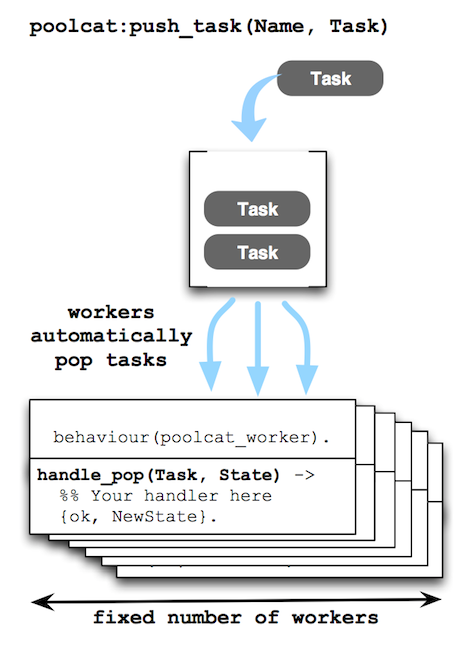

poolcat
=======

Active worker pool with a task queue in OTP manner - This library can
be used to limit the number of concurrency processing your task. In
that case just spawning a worker process can't controll the system
load. In other words, if you find a pattern like



then use poolcat.

Usage
-----

1. write handler

```erlang
-behaviour(poolcat_worker).

init(Any) ->
    {ok, make_state(Any)}.

handle_pop(Task, State) ->
    %% process your task using Task and State
    {ok, NewState}
```

2. create a pool

```erlang
    {ok, Pid} = poolcat:create_pool(your_pool_name, {initstate, foo}),
```

3. push your task and get it processed!

```erlang
    ok = poolcat:push_task(your_pool_name, {task, foo, bar}),
```


License
-------

The name of this software was inspired by poolboy.

Apache 2.0
